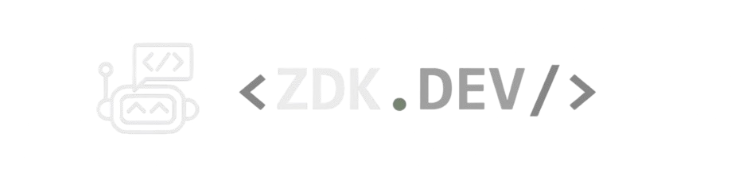

<!-- Banner -->

  

<h1 align="center">👋 ¡Hola! Soy ZDK</h1>
<h3 align="center">Frontend Developer | Aprendiendo Backend | Futuro Fullstack MERN 🚀</h3>

---

## 🚀 Sobre mí
- 💻 Desarrollador con experiencia en **Frontend**.  
- 🎨 He trabajado con **JavaScript, HTML, CSS, React y Next.js**.  
- 🌱 Actualmente estoy aprendiendo **Node.js, Express y MongoDB** para convertirme en **Fullstack MERN Developer**.  
- ⚡ Me gusta usar **herramientas de Inteligencia Artificial y automatización** para mejorar mi flujo de desarrollo.  
- 💡 Apasionado por crear aplicaciones web modernas, escalables y con buenas prácticas.  

---

## 🎓 Formación Académica
- 📚 **Analista Programador** en **INACAP**  
- 🏫 Formación en análisis, diseño y desarrollo de software, con enfoque en programación y buenas prácticas.  

---

## 🛠️ Habilidades

### ⚡ Frontend

### ⚙️ Backend (aprendiendo)

### 🛠️ Herramientas

---

## 🤖 ⚡ AI & Automatización en mi flujo de trabajo
Me gusta apoyarme en herramientas de **IA y automatización** para agilizar y potenciar el desarrollo:  

- 🤝 **GitHub Copilot** – para acelerar la escritura de código.  
- 🖥️ **Cursor IDE** – entorno de desarrollo con IA integrada.  
- 🚀 **Vercel V0** – generación rápida de interfaces con IA.  
- 🔄 **n8n** – automatización de flujos de trabajo.  
- 🧩 **MCPs (Model Context Protocols)** – para integrar IA en proyectos de forma avanzada.  

---

## 🎶 Mi disco favorito

  

---

## 🌐 Conecta conmigo

  
  
  

---

✨ *Gracias por visitar mi perfil. Estoy en constante aprendizaje para convertirme en Fullstack MERN Developer.*
